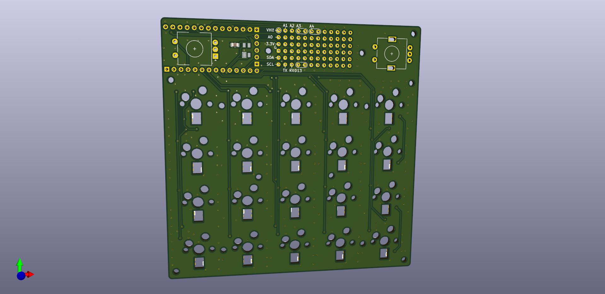
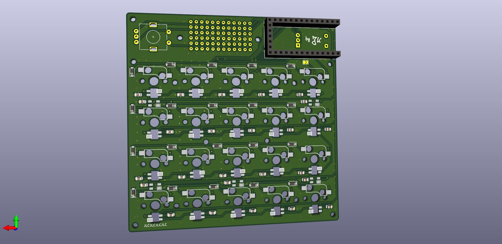

# Numblock #
A small 4x5 numblock to get into pcb design and custom keyboards.

 

## IMPORTANT ##
PCB not tested yet. There's no guarantee that it will work right now!  
Front panel needed to mount 3-pin switches. No files for that provided yet.  
Generally this README and the whole project is far away from being
complete.

## Features ##
- 4x5 keys (cherry mx compatible, hotswappable)
- compatible with variety of Adafruit ItsyBitsy boards:
	- 32u4 (3.3V 8MHz Version!)
	- M4
	- nRF52840
	- RP2040?
	- M0?
- up to 2 rotary encoders (optional)
- indicator RGB led (optional)
- RGB underglow (optional)
- RGB backlight (optional)
- i2c OLED-Display (optional)
- small 'prototyping' area with access to i2c, serial + some analog Pins

## Components ##
- PCB
- 20 1N4148W Diods (SOD123 package)
- 20 hotswap sockets for cherry mx compatible switches
- 20 cherry mx compatible switches (both 3 and 5 pin versions should
work)
- compatible ItsyBitsy controller (cf. features)
- 8 SK6812 mini *HW* RGB LEDs for underglow + top indicator led
- 20 SK6812 mini RGB LEDs for backlight
- 0.1μF 0805 capacitors for each RGB LED (cf. notes)
- up to 2 Alps EC11E rotary encoders
- i2c OLED display, [this
one](https://www.waveshare.com/wiki/0.91inch_OLED_Module) should fit perfectly
- front panel
- some sort of case or an extra back panel
- screws to hold the whole thing together
- rubber feet (otherwise typing won't be much fun)

## Notes ##
- 0.1μF capacitors are recommended according to the datasheet. There are many
designs without them. I do not know whether or not they are necessary.
- A resistor on the LED data line between the controller and the first led is
recommended. I forgot to add that on. Here as well many pcbs do not include
them. It should work. [Supposedly](https://learn.adafruit.com/adafruit-neopixel-uberguide/basic-connections) what could happen is that the first LED in the 'chain' gets fried every
once in a while.

## Resources ##
- [Josef Adamcik's sofle
keyboard](https://josefadamcik.github.io/SofleKeyboard/)
- [KiCad Keyboard Tutorial](https://github.com/ruiqimao/keyboard-pcb-guide)
